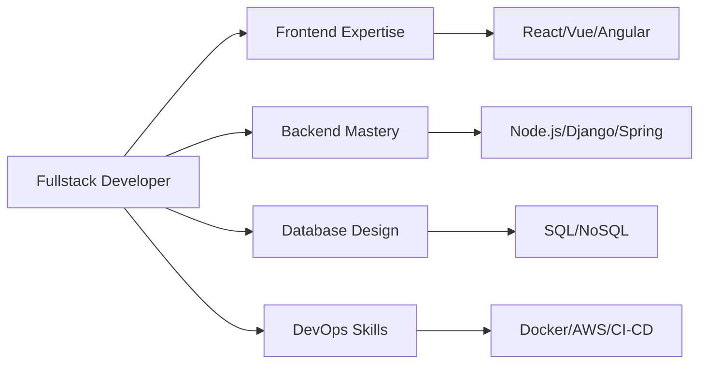

<div align="center">

<!-- Animated Header -->


<!-- Typing SVG -->
<a href="https://git.io/typing-svg"></a>

<br/>

<!-- Profile Views Counter -->


<!-- Animated Divider -->


</div>

## 🎯 About Me


```javascript
const bereket = {
    role: "Fullstack Developer",
    code: ["JavaScript", "TypeScript", "Python", "Java"],
    technologies: {
        frontend: ["React", "Vue.js", "Angular", "Next.js"],
        backend: ["Node.js", "Django", "Spring Boot", "Express"],
        databases: ["MongoDB", "PostgreSQL", "MySQL", "Redis"],
        devOps: ["Docker", "AWS", "Git", "Linux"],
        tools: ["VS Code", "Postman", "Figma"]
    },
    architecture: ["Microservices", "MVC", "REST APIs", "Serverless"],
    currentFocus: "Building scalable web applications",
    funFact: "I debug with console.log() and I'm not ashamed!"
};
```

<br clear="both">

- 🔭 I'm currently working on **innovative fullstack projects**
- 🌱 I'm constantly learning **new technologies and best practices**
- 👯 I'm looking to collaborate on **open source projects**
- 💡 I love solving **complex problems** with elegant solutions
- 📫 Reach me: **[your.email@example.com](mailto:your.email@example.com)**
- ⚡ Fun fact: **I think in code and dream in algorithms**


## 🛠️ Technology Arsenal

<div align="center">

### 🎨 Frontend Development
<p>


</p>

### ⚙️ Backend Development
<p>


</p>

### 🗄️ Databases & Cloud
<p>


</p>

### 🔧 Tools & Technologies
<p>


</p>

</div>


## 📊 GitHub Analytics

<div align="center">
   
  
  
</div>

<div align="center">
  
  
  
</div>

<div align="center">
  
</div>


## 🚀 Featured Projects

<div align="center">

<a href="https://github.com/bereketmengaw/project1">
  
</a>

<a href="https://github.com/bereketmengaw/project2">
  
</a>

</div>

<br/>

<div align="center">

| Project | Description | Tech Stack | Live Demo |
|---------|-------------|------------|-----------|
| 🔥 **E-Commerce Platform** | Full-featured online shopping platform | React, Node.js, MongoDB | [View](link) |
| 🚀 **Social Media Dashboard** | Real-time analytics dashboard | Vue.js, Express, PostgreSQL | [View](link) |
| 💡 **Task Management App** | Collaborative task tracker | Angular, Django, Redis | [View](link) |
| 🎨 **Portfolio Website** | Responsive portfolio template | Next.js, Tailwind CSS | [View](link) |
| 📱 **Chat Application** | Real-time messaging app | React, Socket.io, MongoDB | [View](link) |
| 🌐 **API Gateway** | Microservices API gateway | Node.js, Docker, AWS | [View](link) |

</div>


## 💼 Work Experience

<div align="center">



</div>


## 📈 Contribution Stats

<div align="center">
  
<picture>
  <source media="(prefers-color-scheme: dark)" srcset="https://raw.githubusercontent.com/bereketmengaw/bereketmengaw/output/github-contribution-grid-snake-dark.svg">
  <source media="(prefers-color-scheme: light)" srcset="https://raw.githubusercontent.com/bereketmengaw/bereketmengaw/output/github-contribution-grid-snake.svg">
  
</picture>

</div>


## 🎓 Certifications & Achievements

<div align="center">

| 🏆 Achievement | 📅 Year | 🌟 Issuer |
|---------------|---------|-----------|
| AWS Certified Developer | 2024 | Amazon Web Services |
| React Professional Certificate | 2023 | Meta |
| MongoDB Certified Developer | 2023 | MongoDB University |
| Docker Certified Associate | 2023 | Docker Inc |

</div>


<!-- BLOG-POST-LIST:END -->


## 🤝 Connect With Me

<div align="center">

[](https://linkedin.com/in/bereketmengaw)
[](https://twitter.com/bereketmengaw)
[](https://github.com/bereketmengaw)
[](https://bereketmengaw.dev)
[](mailto:your.email@example.com)
[](https://stackoverflow.com/users/yourprofile)
[](https://dev.to/bereketmengaw)
[](https://medium.com/@bereketmengaw)

<br/>

### 💬 Let's Build Something Amazing Together!

 <em><b>I love connecting with different people</b> so if you want to say <b>hi, I'll be happy to meet you!</b> 😊</em>

</div>


## 🎯 Current Goals

<div align="center">

```javascript
const goals2025 = {
    learning: ["AI/ML", "Cloud Architecture", "Web3"],
    contributing: "More open source projects",
    building: "SaaS products",
    networking: "Growing developer community",
    target: "Become a solution architect"
};

console.log("Let's achieve these together! 🚀");
```

</div>


<div align="center">

### 📊 Weekly Development Breakdown

<!--START_SECTION:waka-->
```text
JavaScript   12 hrs 30 mins  ████████████░░░░░░░░░   48.2%
TypeScript   8 hrs 15 mins   ████████░░░░░░░░░░░░░   31.8%
Python       3 hrs 20 mins   ███░░░░░░░░░░░░░░░░░░   12.9%
CSS          1 hr 10 mins    █░░░░░░░░░░░░░░░░░░░░    4.5%
Other        40 mins         ░░░░░░░░░░░░░░░░░░░░░    2.6%
```
<!--END_SECTION:waka-->

</div>


<div align="center">


</div>


<!-- Animated Footer Wave -->


<div align="center">
  
### Show some ❤️ by starring some of the repositories!


**⭐️ From [Bereket Mengaw](https://github.com/bereketmengaw) | © 2025 All Rights Reserved**

</div>
